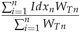
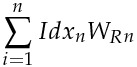

#Overview

###1. A classifier base data structure:

+ A calculation index tree is composed by several `AggregationComponent` objects.
+ An `AggregationComponent` can behave as a `RootComponent` or a `BaseComponent`.
+ A `RootComponent` is identified by a `code`, composed by a `Set<AggregationComponent>` and a `FixedCollection<AggregationWeight>` which stores all weights defined for it.
+ An `AggregationWeight` is a combination of `Currency`, `WeightType` and a value for that combination. Its value is used for the index calculation and selected according to a `WeightSpec` which specify the combination to use.
+ A `BaseComponent` hasn't any `AggregationWeight` associated, it is provided with a `List<Unit>` and 2 or 3 functions depending on the needs of calculation. An `Unit` object is identified by the code of the `BaseComponent` it belongs to and contains a `List<RelatedPrices>`, each `RelatedPrice` represent the pair [_current_price_, _previous_price_].
 
###2. The `AggregationComponent.indexValue(WeightSpec)` method 
+ For any `RootComponent` behavior is predetermined as:
 
    
    
    or
   
    
    
  where **_n_** is the amount of elements on its `Set<AggregationComponent>`; **_Idx_** is the index value and **_W_** the weight value for the type **[_T_ | _R_]** specified of **_n-th_** element.
  
+ For any `BaseComponent` behavior is predetermined by the functions provided with the roles: [**relationPrice**, **priceRelativeReduction**, **indexBase**].
    + **relationPrice**: Define the way to get a **_price relative_** for each related price [__*current_price*__, __*previous_price*__]. By definition is used **_RATIO_**.
    
    + **priceRelativeReduction**: In case of several related prices this function is specified to reduce all **_price relatives_** to one value. Default to **_ARITHMETIC_MEDIA_**.
    
    + **indexBase**: Define the final function to get the **_index value_** of this `BaseComponent`. By definition is used  **_GEOMETRIC_MEDIA_**.

###3. Index and Arithmetic Functions
+ All arithmetic functions used **_SCALED_SUM_, _SCALED_PRODUCT_, _RATIO_** etc. are located on `ArithmeticFunctions` class.

+ Both functions used to get **_index value_** on a `RootComponent` are located on `IndexFunctions` class.
    
    
###4. Factory for `BaseComponent` and `RootComponent` creation
+ `ClassifierComponents` is the class responsible for the creation of `BaseComponent` and `RootComponent` objects.

+ It counts with three static factory methods:
    
    ```java
    ClassifierComponents.newBaseComponent(String code, 
                                          BinaryOperator<Double> priceRelationFunction,
                                          Function<List<BigDecimal>, BigDecimal> indexFunction,
                                          List<Unit> units)
    
    
    ClassifierComponents.newBaseComponent(String code, 
                                          BinaryOperator<Double> priceRelationFunction,
                                          Function<List<BigDecimal>, BigDecimal> relativeReduction, 
                                          Function<List<BigDecimal>, BigDecimal> indexFunction, 
                                          List<Unit> units)
   
    ClassifierComponents.newBaseComponent(String code, 
                                          BinaryOperator<Double> priceRelationFunction,
                                          Function<List<BigDecimal>, BigDecimal> indexFunction,
                                          List<Unit> units)
    ```
